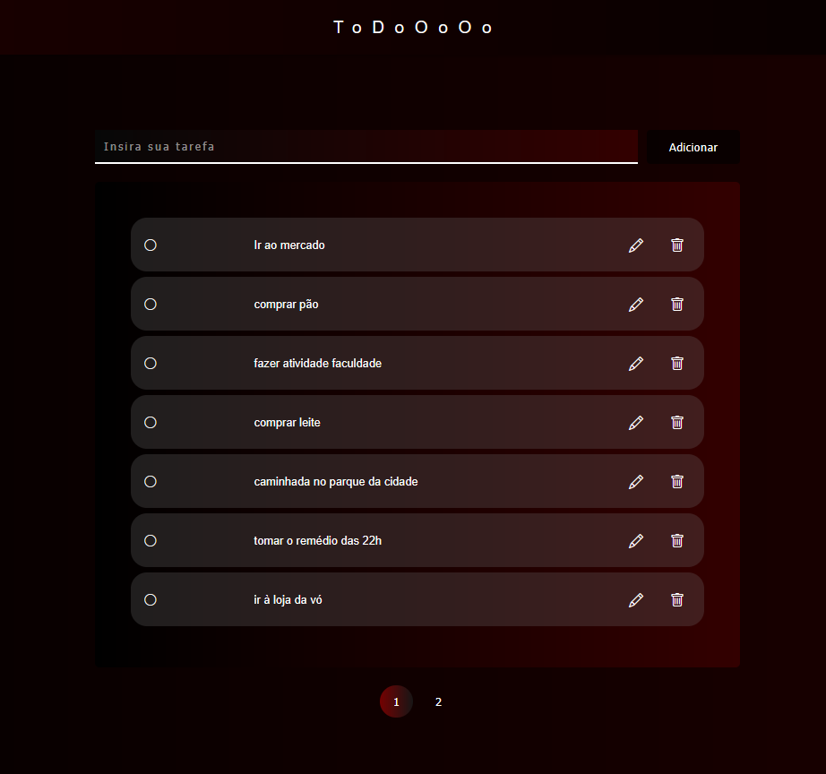

# Todo List

Uma aplicação web simples para gerenciar tarefas do dia a dia, com foco em acessibilidade, usabilidade e organização.

<p align="center" style="border-radius: 10px">
   
</p>

## Funcionalidades

- Adicionar, editar e excluir tarefas
- Marcar tarefas como concluídas
- Paginação automática para listas grandes
- Validação para evitar tarefas duplicadas ou vazias
- Confirmação antes de excluir tarefas
- Acessibilidade: navegação por teclado e uso de ARIA
- Persistência das tarefas no navegador via `localStorage`

## Tecnologias Utilizadas

- HTML5
- CSS3
- JavaScript (ES6+)
- [Bootstrap Icons](https://icons.getbootstrap.com/) (ícones)

## Como Usar

1. **Clone o repositório:**
    ```sh
    git clone https://github.com/seu-usuario/todo-list.git
    ```
2. **Abra o arquivo `index.html` em seu navegador.**
3. **Adicione suas tarefas no campo de texto e clique em "Adicionar".**
4. **Use os botões de editar (✏️) e excluir (🗑️) para gerenciar suas tarefas.**
5. **Marque tarefas como concluídas clicando no círculo ao lado do texto.**

## Estrutura do Projeto

```
todo-list/
├── index.html
├── script.js
├── style.css
└── README.md
```

## Acessibilidade

- Todos os botões possuem `aria-label`.
- É possível marcar/desmarcar tarefas usando a tecla `Espaço` ou `Enter`.
- O foco do teclado é gerenciado para facilitar a navegação.

## Personalização

- Edite o arquivo `style.css` para alterar o visual da lista.
- Os ícones podem ser trocados facilmente por outros do [Bootstrap Icons](https://icons.getbootstrap.com/).

## Licença

Este projeto está licenciado sob a licença MIT.

---

Desenvolvido por Ryan Hugo :).
